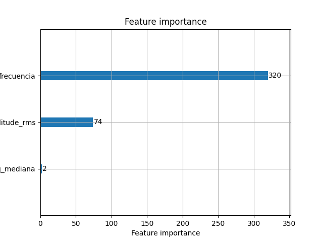

# sEMG analysis for Fatigue Automatic Detection
---

# EMG Fatigue Detection

This script performs fatigue inference on user-provided EMG (Electromyography) signals using a pre-trained LightGBM model.

### Results

**ROC Curve**


**Features**




---
**Predictions by the model**


---
## Prerequisites

- Python 3.x installed
- Required Python packages installed (install with `pip install -r requirements.txt`)

## Getting Started

1. **Clone the repository to your local machine:**

   ```bash
   git clone https://github.com/your-username/sEMG-Automatic-Detection.git

## File Structure

- **inference.py:** The main script for performing fatigue inference.
- **process_data.py:** Module containing functions for processing EMG data.
- **models/:** Directory containing the pre-trained LightGBM model file.
- **selected_emgs/:** Directory where user EMG files can be stored.

## Additional Notes

- Ensure that your EMG signal files have a `.txt` extension and are formatted correctly.
- The script uses a pre-trained LightGBM model located in the `models/` directory.
- Feel free to modify the script or add more features based on your needs.

## Running the Project

1. Open a terminal and navigate to the project directory.

2. Run the inference.py script:
    ```bash
    python inference.py path/to/emg/folder
Replace path/to/emg/folder with the path to the folder containing your EMG signal files.

3. The script will list the available EMG files in the specified folder. Enter the number corresponding to the file you want to evaluate.

4. The script will process the selected EMG file, perform fatigue inference, and display the results.
